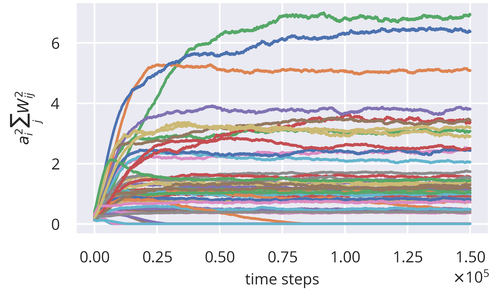
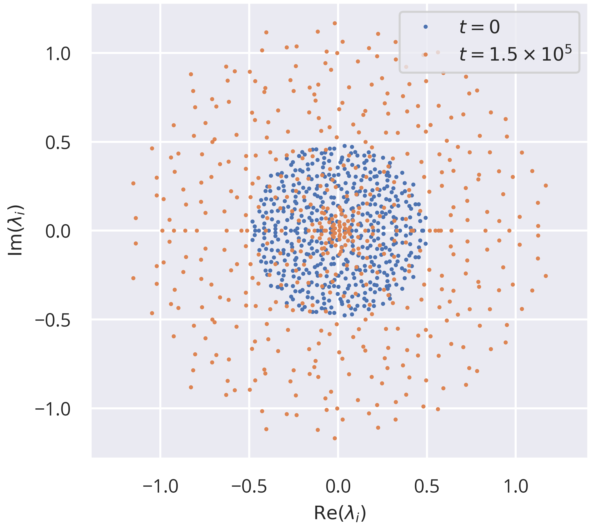
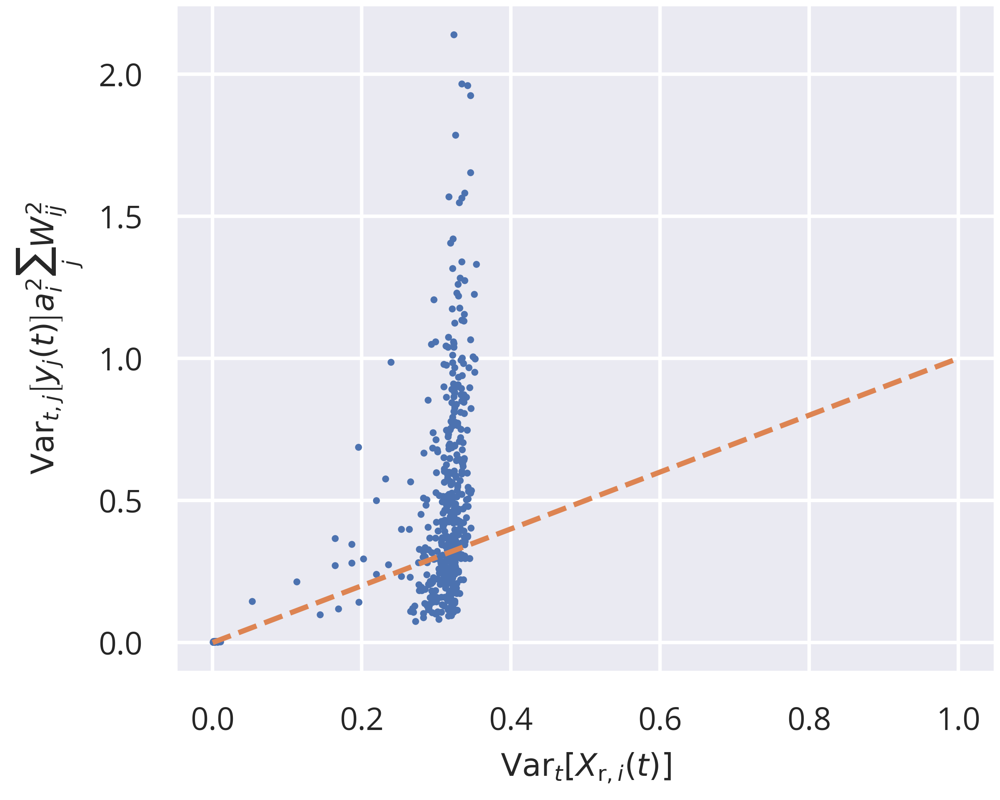
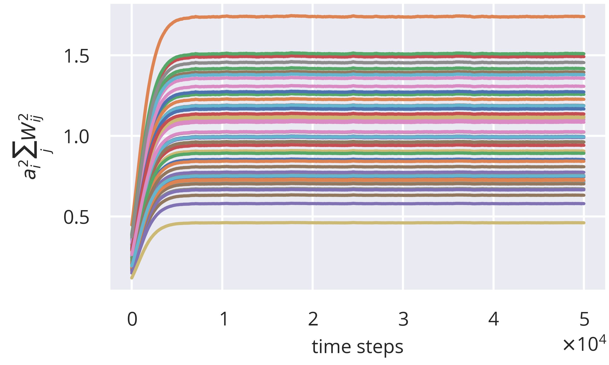
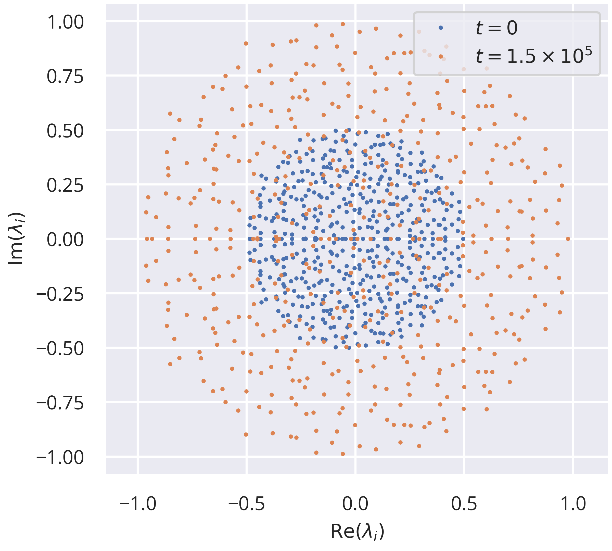

## Solving the Inhomogeneous Self-Consistency Equation Dynamically

Given the equation
$$
\left\langle y_{{\rm y},i}^2 \right\rangle_t = \int_{-\infty}^\infty \tanh^2(x) \mathcal{N}(x,\mu_i,\sigma_i^2) \mathrm{d}x
$$
we approximated $\tanh^2(x)\approx 1-\exp(-x^2)$ , which made the integral
$$
\begin{align}
\left\langle y_{{\rm y},i}^2 \right\rangle_t &= 1 - \frac{1}{\sqrt{2\pi \sigma_i^2}} \int_{-\infty}^\infty \exp\left(-x^2\left[1+\frac{1}{2\sigma_i^2}\right] + x\frac{\mu_i}{\sigma_i^2} - \frac{\mu_i^2}{\sigma_i^4}\right) \mathrm{d}x \\
&= 1-\frac{\exp\left(\frac{\mu_i^2}{4}\frac{1 + 2/\sigma_i^2}{2\sigma_i^2+1}\right)}{\sqrt{1+2\sigma_i^2}} \; . \label{eq:self_consist}
\end{align}
$$
Under the assumption that neither recurrent weights nor node activities are correlated in time or across the population, we have
$$
\begin{align}
\sigma^2_i &= a_i^2 N \left\langle W^2_{ij} \right\rangle_j \mathrm{Var}\left[y_j(t)\right]_{j,t} + \mathrm{Var}\left[E_i(t)\right]_t \\
\mu_i &= a_iN\left\langle W_{ij} \right\rangle_j\left\langle y_j(t)\right\rangle_{j,t} + \left\langle E_i(t) \right\rangle_{t} \; .
\end{align}
$$
The condition that we would like to fulfill is $a_i^2 N \left\langle W^2_{ij}\right\rangle_j = 1 \; \forall i$. Given that we assume balanced weights $\left\langle W_{ij} \right\rangle_j = 0 \; \forall i$, this yields
$$
\begin{align}
\sigma^2_i &= \mathrm{Var}\left[y_j(t)\right]_{j,t} + \mathrm{Var}\left[E_i(t)\right]_t \\
\mu_i &= \left\langle E_i(t) \right\rangle_{t} \; .
\end{align}
$$
If the mean of the input was zero, $\eqref{eq:self_consist}$ would become
$$
\left\langle y^2_i \right\rangle_t = 1-1/\sqrt{1+2\mathrm{Var}\left[y_j(t)\right]_{j,t} + 2 \mathrm{Var}\left[E_i(t)\right]_t}
$$
We are facing the problem that this does not have a general analytical solution. However, we can try to dynamcially solve this equation by simply measuring the right hand side of the equation during adaptation and setting this as a target value for $\left\langle y^2_i \right\rangle_t$ . 

We implemented this using the following update rules:
$$
\begin{align}
X_{{\rm r},i}(t) &= a_i(t-1) \sum_{j=1}^{N_{\rm y}} W_{{\rm r},ij} y_j(t-1) \\
X_{{\rm e},i}(t) &= \sum_{j=1}^{N_{\rm e}} W_{{\rm e},ij} u_j(t) \\
y_i(t) &= \tanh\left(X_{{\rm r},i}(t) + X_{{\rm e},i}(t) - b_i(t-1)\right) \\
\mu_{{\rm y},i}(t) &= (1-\epsilon_\mu)\mu_{{\rm y},i}(t-1) + \epsilon_\mu y_i(t) \\
\mu_{{\rm e},i}(t) &= (1-\epsilon_\mu)\mu_{{\rm e},i}(t-1) + \epsilon_\mu X_{{\rm e},i}(t) \\
\sigma^2_{{\rm y},i}(t) &= (1-\epsilon_\sigma)\sigma^2_{{\rm y},i}(t-1) + \epsilon_\sigma \left[y_i(t) - \mu_{{\rm y},i}(t)\right]^2 \\
\sigma^2_{{\rm e},i}(t) &= (1-\epsilon_\sigma)\sigma^2_{{\rm e},i}(t-1) + \epsilon_\sigma \left[X_{{\rm e},i}(t) - \mu_{{\rm e},i}(t)\right]^2 \\
y^2_{{\rm targ},i}(t) &= 1 - 1/\sqrt{1+2\left\langle\sigma^2_{{\rm e},j}(t)\right\rangle_j + 2\sigma^2_{{\rm e},i}(t) } \\
a_i(t) &= a_i(t-1) + \epsilon_{\rm a} \left(y^2_{{\rm targ},i}(t) - y^2_i(t)\right) \\
b_i(t) &= b_i(t-1) + \epsilon_{\rm b} y_i(t)
\end{align}
$$
We tested this with the following parameters:

| $N$  | $p_{\rm r}$ | $p_{\rm e}$ | $\sigma_{\rm w,e}$ | $\epsilon_a$ | $\epsilon_b$ | $\epsilon_\mu$ | $\epsilon_\sigma$ | $t_{\rm total}$   |
| ---- | ----------- | ----------- | ------------------ | ------------ | ------------ | -------------- | ----------------- | ----------------- |
| 500  | 0.1         | 1           | 1                  | $10^{-3}$    | $10^{-3}$    | $10^{-4}$      | $10^{-3}$         | $1.5 \times 10^5$ |

As shown in the plot, this control mechanism is not good at tuning gains to appropriate values.

Interestingly, the resulting spectral radius after adaptation is not as far off the target of unit radius as the individual gains suggest:

Still, we see quite a lot of bunching in the distribution at the origin, which is generally an effect of heterogeneity of  $a_i^2 N \left\langle W^2_{ij}\right\rangle_j$ as shown in the first plot. One reason for this is the fact that the approximation for the variance of the recurrent input is very far from accurate:

The orange line denotes a one-to-one mapping, indicating that many of the predicted variances are very far from the actual ones. Since this is a crucial part of how to set our target variance, we cannot expect to get good results.

### An Alternative Mechanism

As we have seen, the previous approach did not yield the desired results. However, we may take a slightly different approach to this problem by stating that the essential property that we are trying to achieve is that a mapping from neural activities at time step $t-1$ to the recurrent membrane potential at $t$ should, on average, neither be contractive nor expanding. That is
$$
\left\langle \frac{||\mathbf{X}_{\rm r}(t)||^2}{||\mathbf{y}(t-1)||^2}\right\rangle_t = 1 \; .
$$
Being aware that we do not necessarily find exact equality, we state that
$$
\begin{align}
 \frac{\left\langle ||\mathbf{X}_{\rm r}(t)||^2\right\rangle_t}{\left\langle ||\mathbf{y}(t-1)||^2\right\rangle_t} &= 1 \\ \left\langle ||\mathbf{X}_{\rm r}(t)||^2\right\rangle_t &= \left\langle||\mathbf{y}(t)||^2\right\rangle_t \; .
 \end{align}
$$
Note that we already assumed to have access to a mean field over the square of neural activities. If we assume that we can also access a mean field over recurrent membrane potentials, this allows us to modify the gain update rule in the following way:
$$
a_i(t) = a_i(t-1) + \epsilon_{\rm a} a_i(t-1) \left[ \left\langle y_j^2(t)\right\rangle_j - \left\langle X_{{\rm r},j}^2(t)\right\rangle_j\right]
$$
Note that the proportionality factor $a_i(t-1)$ is optional and simply accounts for a “stretching” of the gain vector proportional to the difference term.

As we can see, the tuning towards unit spectral radius is almost perfect.